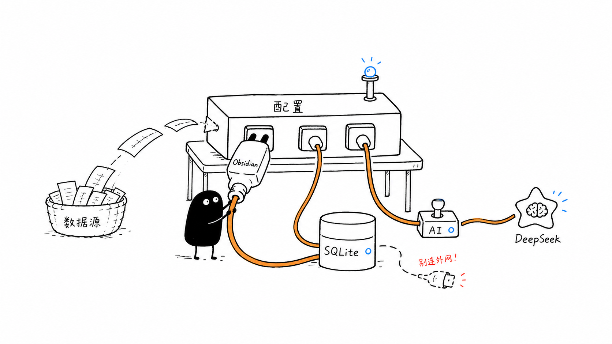

# 配置指导

本文档说明如何安装 Work Journal Agent、配置 Obsidian、数据源、DeepSeek
和后台自动同步。



## 安装

### macOS DMG

内部试用可以直接下载 Release 里的 DMG：

1. 打开 [GitHub Releases](https://github.com/shaoyang01/work-journal-agent/releases)。
2. 下载 `Work-Journal-Agent-版本号.dmg`。
3. 打开 DMG，把 `Work Journal Agent.app` 拖到 Applications。
4. 首次打开如果提示无法验证开发者，在系统设置的隐私与安全性里允许打开。
5. 点击顶部菜单栏 `WJ` 图标，进入设置窗口完成配置。

### 源码安装

macOS 最简单方式是在 Finder 里双击：

```text
Install.command
```

macOS/Linux 也可以运行：

```bash
./scripts/install.sh
```

Windows PowerShell：

```powershell
.\scripts\start.ps1
```

接受默认值快速初始化：

```bash
./scripts/install.sh --yes
```

开发安装：

```bash
python -m pip install -e .
```

如果使用 `uv`：

```bash
uv tool install .
```

## 配置向导

安装后可以随时运行：

```bash
wj setup
```

配置向导会询问：

- 配置文件路径。
- SQLite 数据库文件路径。
- Obsidian vault 路径。
- Daily、Tasks、Knowledge 目录名。
- 是否生成 Knowledge 笔记。
- 是否启用 DeepSeek AI 分析。
- 是否启用 Codex、Claude Code、OpenCode、Kun、ZCode 采集。
- 是否安装 macOS 后台自动写入器。

## 配置文件

默认配置文件路径：

```text
~/.config/work-journal-agent/config.toml
```

Windows 可以放到：

```text
%APPDATA%\work-journal-agent\config.toml
```

也可以复制模板：

```bash
mkdir -p ~/.config/work-journal-agent
cp config/config.example.toml ~/.config/work-journal-agent/config.toml
```

最小配置：

```toml
[storage]
database_path = "~/.local/share/work-journal-agent/work-journal.db"
output_dir = "./out"

[obsidian]
vault_path = "/path/to/your/ObsidianVault"
daily_dir = "Daily"
task_dir = "Tasks"
write_task_notes = true
```

`vault_path` 留空时会写到 `storage.output_dir`，方便先试跑。

## 本地存储

升级到 SQLite 后，新数据会写入：

```text
~/.local/share/work-journal-agent/work-journal.db
```

SQLite 中保存：

- 采集到的工作事件。
- 需求线程和每日确认快照。
- App 状态。
- AI 缓存和 AI 任务进度。

如果本机已有旧版 JSON/JSONL 数据，可以迁移一次：

```bash
wj migrate-storage
```

默认读取旧路径：

```text
~/.local/share/work-journal-agent/inbox/events.jsonl
~/.local/share/work-journal-agent/requirements/
~/.local/share/work-journal-agent/state/status.json
~/.local/share/work-journal-agent/ai-cache/
```

如果旧数据在自定义位置，可以显式指定：

```bash
wj migrate-storage \
  --legacy-inbox /path/to/events.jsonl \
  --legacy-requirements-dir /path/to/requirements \
  --legacy-state-dir /path/to/state \
  --legacy-ai-cache-dir /path/to/ai-cache
```

迁移命令是幂等的，重复执行不会重复写入事件。

## DeepSeek AI

安装向导会询问是否启用 DeepSeek AI 分析。启用后，API Key 会写入本机私有
文件：

```text
~/.config/work-journal-agent/secrets.env
```

如果机器上已有 `DEEPSEEK_API_KEY`，也可以直接复用：

```bash
export DEEPSEEK_API_KEY="你的 key"
```

配置示例：

```toml
[ai]
enabled = true
provider = "deepseek"
base_url = "https://api.deepseek.com"
model = "deepseek-v4-pro"
api_key_env = "DEEPSEEK_API_KEY"
timeout_seconds = 180
cache_enabled = true
cache_retention_days = 7
cluster_review_enabled = true
cluster_review_timeout_seconds = 240
cluster_review_min_confidence = 0.75
knowledge_enabled = false
```

DeepSeek 只会收到筛选压缩后的任务事件，不会上传完整聊天全文。AI 结果默认
缓存最近 7 天；如果任务没有新增事件，会复用缓存。

只配置 DeepSeek：

```bash
wj ai setup
```

关闭 DeepSeek：

```bash
wj ai disable
```

## 数据源配置

### Codex

Codex 当前通过本地 session 日志导入，不需要 hook：

```text
~/.codex/sessions/YYYY/MM/DD/rollout-*.jsonl
```

后台 `wj sync` 会自动导入当天新增的 Codex 用户需求、最终回复和 patch 文件
事件。

### Claude Code

安装 CLI 后，可以在 Claude Code settings 中配置 hook。macOS/Linux 示例：

```json
{
  "hooks": {
    "UserPromptSubmit": [
      {
        "matcher": "",
        "hooks": [
          {
            "type": "command",
            "command": "/path/to/work-journal-agent/hooks/claude/hook.sh UserPromptSubmit"
          }
        ]
      }
    ],
    "PostToolUse": [
      {
        "matcher": "",
        "hooks": [
          {
            "type": "command",
            "command": "/path/to/work-journal-agent/hooks/claude/hook.sh PostToolUse"
          }
        ]
      }
    ],
    "Stop": [
      {
        "matcher": "",
        "hooks": [
          {
            "type": "command",
            "command": "/path/to/work-journal-agent/hooks/claude/hook.sh Stop"
          }
        ]
      }
    ]
  }
}
```

Windows PowerShell 示例：

```json
{
  "hooks": {
    "UserPromptSubmit": [
      {
        "matcher": "",
        "hooks": [
          {
            "type": "command",
            "command": "powershell -ExecutionPolicy Bypass -File C:\\path\\to\\work-journal-agent\\hooks\\claude\\hook.ps1 UserPromptSubmit"
          }
        ]
      }
    ]
  }
}
```

hook 只写轻量事件，不会把 transcript 全量写入 Obsidian。

### OpenCode

启用后会生成：

```text
~/.config/opencode/plugins/work-journal-agent.js
```

OpenCode 启动时会自动加载这个插件。插件会写入消息、工具执行、文件变更和
session diff 摘要，不会保存 before/after 全量内容。

手动导入当天 OpenCode 事件：

```bash
wj opencode import --date 2026-06-11
```

自定义路径：

```bash
wj opencode import --storage-root /path/to/opencode/storage
```

### Kun Agent

Kun 采集默认关闭。开启后，`wj sync` 会读取 Kun 本地 threads 和当前项目的
`.kunsdd` 文档。

配置示例：

```toml
[sources.kun]
enabled = true
storage_root = "~/.kun/data"
project_root = "/path/to/project"
```

手动导入当天 Kun 事件：

```bash
wj kun import --date 2026-06-11
```

### ZCode

ZCode 采集默认会在检测到 `~/.zcode/cli` 时启用。采集器只读本地 sqlite
数据库，导入用户需求、助手结论、工具执行和 session 文件变更摘要。

配置示例：

```toml
[sources.zcode]
enabled = true
storage_root = "~/.zcode/cli"
```

手动导入当天 ZCode 事件：

```bash
wj zcode import --date 2026-06-11
```

## 后台自动同步

macOS 下配置向导会询问是否安装后台自动写入器。开启后会创建：

```text
~/Library/LaunchAgents/com.shaoyang01.work-journal-agent.daily.plist
```

默认每 60 分钟刷新一次今天的 Daily。电脑重启并登录后会自动恢复。

手动安装或重装：

```bash
wj schedule install --every-minutes 60
```

查看状态：

```bash
wj schedule status
```

卸载后台任务：

```bash
wj schedule uninstall
```

## 卸载

macOS 最简单方式是在 Finder 里双击：

```text
Uninstall.command
```

macOS/Linux：

```bash
./scripts/uninstall.sh
```

Windows PowerShell：

```powershell
.\scripts\uninstall.ps1
```

默认卸载会移除 launchd 后台任务、Claude Code hooks 和 Python 包安装，但
保留配置和历史数据。需要一起删除时：

```bash
./scripts/uninstall.sh --remove-config --remove-data
```
