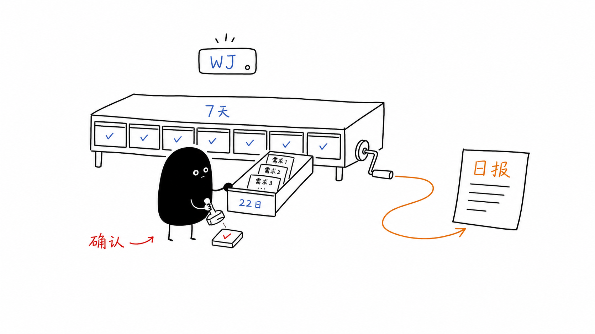

# 使用指南

本文档说明 Work Journal Agent 的日常使用方式，包括手动记录、同步、日报
生成、需求确认、菜单栏 App 和本地验证。



## 手动记录事件

临时记一条工作日志：

```bash
wj note "今天完成了 work-journal-agent 的历史日报补生成"
```

更完整的事件命令：

```bash
wj event add \
  --source codex \
  --type conclusion \
  --summary "确定采用最近 7 天历史日报入口" \
  --decision "README 保留简介，配置细节拆到 docs"
```

记录文件产出：

```bash
wj event add \
  --source manual \
  --type note \
  --summary "补充配置说明" \
  --file docs/configuration.md
```

## 生成每日笔记

正常情况下不需要手动运行，macOS 后台任务会定期执行：

```bash
wj sync
```

`wj sync` 会导入已启用来源的当天事件，并刷新当天需求候选。Knowledge 不会
在 `sync` 中生成，避免日报和知识沉淀共用一次长时间等待。

预览某天结果：

```bash
wj sync --date 2026-06-11 --dry-run
```

写入 Obsidian 或 fallback 输出目录：

```bash
wj sync --date 2026-06-11
```

只生成指定日期日报：

```bash
wj generate-daily --date 2026-06-22
```

每日生成会写入：

```text
Daily/YYYY-MM-DD.md
Tasks/YYYY-MM-DD/需求标题.md
```

## 菜单栏 App

安装或重建菜单栏 App：

```bash
scripts/install-menubar.sh
```

顶部状态栏出现 `WJ` 后，可以打开：

- 最近 7 天日报/确认。
- 需求管理。
- 同步最新事件。
- 生成今日日报。
- 设置窗口。
- 本地数据目录和日志。

如果只想生成一个本机测试版，不安装到 `~/Applications`：

```bash
scripts/build-local-app.sh
```

构建可分享的内部试用 DMG：

```bash
scripts/build-dmg.sh
```

产物会写到：

```text
dist/Work-Journal-Agent-版本号.dmg
```

## 需求确认

如果 Daily 里出现文件路径式标题，或同一个需求跨多个 Agent 会话，可以在
菜单栏 App 中打开“最近 7 天日报/确认”。

确认窗口支持：

- 修改候选需求标题。
- 标记确认、待确认或忽略。
- 归并到已有需求。
- 最近 7 天内切换历史日期。
- 对指定日期补生成日报。

保存后会写入本机 SQLite。后续 `wj generate-daily` 会优先使用已确认的需求
标题。

也可以使用本地 HTML 确认页调试：

```bash
wj requirements review --date 2026-06-12
```

相关 CLI JSON 通道：

```bash
wj requirements payload --date 2026-06-12
wj requirements save --date 2026-06-12
wj app config
wj app config-save
wj app status
```

## 需求管理

菜单栏 App 的“需求管理”用于维护长期需求：

- 查看进行中、暂停中、已完成需求。
- 手动创建或改名需求。
- 合并重复需求。
- 完结需求，让它不再出现在确认页下拉框中。

长期需求会保留在本机数据库中，用来支持跨天标题复用。

## 历史日报

普通入口只展示最近 7 天。这个限制用于控制确认候选和补生成入口，不会删除
已经生成的 Obsidian 日报，也不会删除长期需求池。

推荐工作流：

1. 打开最近 7 天日报/确认。
2. 选择历史日期。
3. 保存确认结果。
4. 点击“生成该日日报”。

不要把昨天的事件写进今天日报。日报按事件发生日期归档，确认可以晚到。

## Knowledge

Knowledge 生成功能目前是实验性能力，默认关闭。只有同时开启
`[ai].knowledge_enabled` 和 `[obsidian].write_knowledge_notes` 后才会生成：

```bash
wj generate-knowledge --date 2026-06-11
```

当前建议保持关闭，等知识沉淀策略明确后再启用。

## 本地验证

运行测试：

```bash
PYTHONPATH=src python -m unittest discover -s tests
```

Swift 菜单栏 App 编译检查：

```bash
swiftc macos/WorkJournalMenuBar/main.swift -o /tmp/work-journal-menubar-check
```

构建本机 App：

```bash
scripts/build-local-app.sh
```

构建 DMG：

```bash
scripts/build-dmg.sh
```

## 多设备建议

- 项目代码用 Git 同步。
- 每台设备维护自己的 `~/.config/work-journal-agent/config.toml`。
- Obsidian vault 可以用 iCloud、Syncthing、Git 或 Obsidian Sync 同步。
- SQLite 数据库默认在本机用户目录，不建议提交到仓库。
